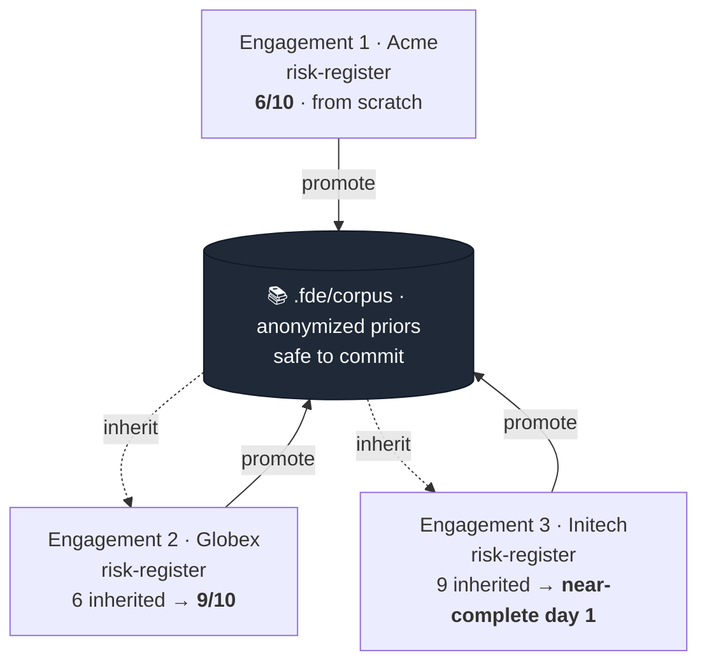
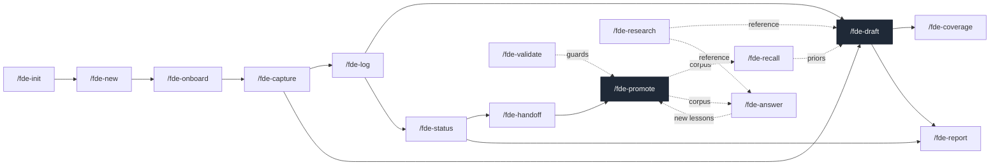
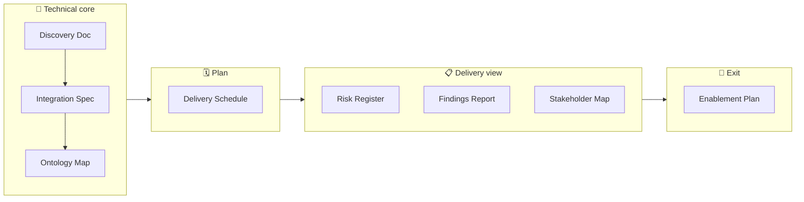

<div align="center">

# FDE-SKILLS

**Your client engagements should compound. Right now they don't.**

<a href="LICENSE"></a>


English · [日本語](./docs/README.ja.md)

</div>

A Claude Code skill pack for Forward Deployed Engineers, delivery consultants, and
embedded PMs. Every engagement you run produces the same *kinds* of deliverable:
a risk register, a findings report, a stakeholder map. Today each one starts from
a blank page. FDE-SKILLS makes the **schema** behind each deliverable persist and
pre-populate across engagements, so client #3 starts where client #2's hard-won
structure left off.

No hosted backend. No API key. No vendor lock-in. The skills run on **your own
Claude Code**; the spine underneath is plain shell. Your client data never leaves
your machine.

---

## 🚀 Quick start

No marketplace. Clone the repo and run the installer. It's plain `cp` under the
hood (read it first): it copies the 17 skills into your personal skills dir and
the 2 shared subagents into your personal agents dir, both namespaced `fde-*` (so
the generic names can't collide). The shell spine rides inside the `init` skill,
so there's no second install location:

```bash
git clone https://github.com/mk668a/fde-skills
cd fde-skills
./install.sh                 # copies fde-* skills + subagents into ~/.claude
# ./install.sh -u            # uninstall everything it copied
```

Prefer to do it by hand? It's two copies (install.sh adds one `sed` on top: it
also rewrites each skill's `name:` to `fde-*`, so the commands become
`/fde-init`, `/fde-draft`, …; a bare copy leaves them as `/init`, `/draft`, which
can clash):

```bash
# 1. skills (one dir each; init carries the spine templates with it)
for d in skills/*/; do cp -R "$d" ~/.claude/skills/"fde-$(basename "$d")"; done
# 2. the shared subagents (names already fde-*)
cp agents/*.md ~/.claude/agents/
```

Then, in any engagement workspace, just describe what you want (or use the
explicit command):

```text
set up fde here              # or /fde-init  (scaffolds .fde/: spine + schemas + empty corpus)
new engagement with Acme     # or /fde-new "Acme Corp"
```

`/fde-init` copies the spine from its own bundled `templates/` (resolved via
`${CLAUDE_SKILL_DIR}`) into your workspace's `.fde/`. From there the lifecycle
skills take over. Everything runs on **your own Claude Code**; nothing is hosted.

---

## 🔁 The compounding loop

A deliverable isn't a document. It's a **typed schema of slots**, and the schema
lives in a shared workspace that outlives any single engagement.



Solid arrows **promote** anonymized learnings up into the corpus; dashed arrows
**inherit** them down into the next engagement. Coverage climbs left to right.
That's the whole product.

It's the **gravel road → paved highway** pattern Palantir's forward-deployed
model runs on: build a fast, client-specific solution (the gravel road), then
generalize its durable structure into shared infrastructure the next engagement
drives on (the paved highway). Here the paved highway is the typed schema +
anonymized corpus, and `/fde-promote` is the move that paves it.

---

## 🧱 Two layers

FDE-SKILLS is built as a deterministic spine under an LLM layer: the same
"non-deterministic output, deterministic gate" discipline it asks you to trust.
The LLM layer itself splits in two: the skills you invoke, and the shared
subagents they delegate verbose, isolated work to.

| Layer | What it is | Examples |
|---|---|---|
| **LLM skills** (`skills/*`) | Read messy notes, fill slots, anonymize, judge what's reusable | `/fde-draft`, `/fde-promote`, `/fde-onboard` |
| **Shared subagents** (`agents/*`) | Isolated-context workers more than one skill delegates to, so heavy reading never floods the chat | `fde-retriever` (recall + answer), `fde-researcher` (research + answer) |
| **Deterministic spine** (`.fde/bin/*.sh`) | Count, scaffold, redact, validate, render (no LLM, fully reproducible) | `fde-coverage.sh`, `fde-promote.sh`, `fde-validate.sh`, `fde-report.sh` |

The coverage number you watch climb is computed by a shell script, not estimated
by a model. The confidentiality guard that keeps client names out of the corpus
is a shell script too, so you can trust it the same way every run. And the
retrieval that backs `/fde-answer` runs in a subagent that physically cannot read
another client's directory.

---

## 💬 You don't memorize commands, you just talk

There are 17 skills, but you rarely type a `/fde-` command. Each skill carries a
precise *"use when…"* description, so Claude Code **auto-selects the right one
from a plain-English prompt**. Describe the outcome; the matching skill fires.

| You type (free prompt) | Skill that fires |
|---|---|
| "set up fde here" | `/fde-init` |
| "new engagement with Globex, fintech pilot" | `/fde-new` |
| "turn these call notes into a context map" | `/fde-onboard` |
| "draft the integration spec for Acme" | `/fde-draft` |
| "wrap up what we did today" | `/fde-log` |
| "how complete is the risk register?" | `/fde-coverage` |
| "research the HL7 FHIR standard" | `/fde-research` |
| "what did we learn about pilots like this?" | `/fde-recall` |
| "the client asked how we handle SSO failures, draft an answer" | `/fde-answer` |
| "make these learnings reusable across clients" | `/fde-promote` |
| "write this week's status for the sponsor" | `/fde-status` |
| "export the risk register as a PDF" | `/fde-report` |
| "check nothing client-identifying is leaking" | `/fde-validate` |

The explicit `/fde-*` form still works when you want to force a specific skill,
but treat it as the override, not the default. The slash table below is a map of
what's available, not a syntax you have to recall.

---

## 🧰 The 17 skills

They form one lifecycle loop: set up once, then per engagement onboard →
capture → log → draft → ship, and `promote` paves what you learned into the
corpus that `recall` feeds back into the next `draft`. You trigger each by
**describing what you want** (see above); the slash names are just labels for the
diagram.



| Skill | When | Method anchor |
|---|---|---|
| `/fde-init` | Set up the `.fde/` workspace (once) | Idempotent scaffold (won't clobber) |
| `/fde-new` | Start a new client engagement | Per-client directory isolation |
| `/fde-onboard` | Turn first-week materials into a context map | Jobs-To-Be-Done (Christensen) + Five Whys (Toyoda) |
| `/fde-capture` | Log a note / decision / risk / finding | Atomic note, routed to a slot |
| `/fde-log` | Roll up the day into one dated journal entry | Standup three questions (Scrum) |
| `/fde-draft` | **Draft a typed deliverable, inherits priors across clients** | Slot-schema inheritance |
| `/fde-coverage` | See slot-fill rate and what's left | Definition of Done / exit criteria |
| `/fde-research` | Research a topic on the web into the shared `research/` library | Source triangulation (primary > secondary) |
| `/fde-recall` | Pull relevant anonymized priors from past engagements | Priors surfaced as patterns |
| `/fde-answer` | Answer a client question, cited from the knowledge base | Retrieval-grounded, cited answer |
| `/fde-promote` | Lift learnings into the shared corpus (anonymized) | Gravel road → paved highway (Palantir) |
| `/fde-status` | Generate a client-facing status update | BLUF (Bottom Line Up Front) |
| `/fde-report` | Render a deliverable to clean HTML / PDF (live mermaid) | Self-contained, zero-dep render |
| `/fde-handoff` | Assemble an engagement closeout | Closeout against the context map |
| `/fde-list` | Overview of all engagements + progress | Portfolio overview |
| `/fde-schema` | Inspect / add deliverable types and slots | Typed schema evolution |
| `/fde-validate` | Confidentiality + integrity guard | Identifier-leak gate |

---

## 📦 The eight deliverable schemas

FDE-SKILLS ships with eight deliverable schemas spanning the whole engagement
arc, and you add your own with `/fde-schema`:



Every slot prompt is **grounded in a named method**, so drafts come out in the
vocabulary the work actually uses, not vague filler. A Discovery Doc leans on
Jobs-To-Be-Done (Christensen), Five Whys (Toyoda) and Working-Backwards (Amazon);
an Integration Spec on Medallion architecture (Databricks), idempotency keys
(Stripe) and the Foundry ontology (Palantir); a Delivery Schedule on the Critical
Path Method (Kelley & Walker) and Working-Backwards from go-live; a Stakeholder
Map on Mendelow's power/interest grid and MEDDPICC; a Findings Report on the
Pyramid Principle (Minto). Naming the method is also a precision trick: it anchors
the model on an established framework instead of guessing.

> `install.sh` namespaces the skills as `fde-*`, so the explicit commands are
> `/fde-init`, `/fde-draft`, …. The repo / product is **FDE-SKILLS** (like the
> `claude-code` repo whose command is `claude`).

---

## ✨ A schedule, a daily record, reports, research, and cited answers

The lifecycle adds five things an embedded engineer actually needs day to day:

- **A schedule that compounds.** Delivery Schedule is the eighth deliverable, not
  a one-off file. Its *structure* (the discovery → integration → pilot →
  production → enablement arc, the cadence, the exit criteria) recurs almost
  unchanged across clients, so `/fde-draft` pre-fills it from the corpus and you
  mostly just set this client's dates (Working-Backwards from go-live; critical
  path via CPM).
- **A daily record.** `/fde-capture` logs atomic notes as they happen; `/fde-log`
  rolls the day up into one dated `journal/<date>.md` (standup-style: done /
  next / blocked). The day feeds the week (`/fde-status`) feeds the closeout
  (`/fde-handoff`).
- **Clean HTML / PDF reports.** `/fde-report` tidies a deliverable and renders a
  self-contained HTML page with **live mermaid diagrams**, then a PDF on request.
  Zero dependency: the HTML carries its own print CSS, so anyone can open it and
  Print → Save as PDF. With headless Chrome installed, `--pdf` renders the
  diagrams into the PDF directly.
- **A shared research library.** `/fde-research` does web research into a
  workspace-level `research/` dir that every engagement draws on: a data
  standard, a vendor trade-off, a regulatory shape. It's client-agnostic and
  commit-safe, guarded by the same identifier check as the corpus.
- **Cited answers from the knowledge base.** `/fde-answer` takes a client's
  question and composes a grounded reply that cites this engagement's notes, the
  anonymized corpus, and the research library. Every claim is sourced and gaps are
  flagged. Anything durable it surfaces routes back through `/fde-promote` or
  `/fde-capture`, so answering also grows the knowledge base.

---

## 🗂 Workspace layout

`/fde-init` seeds this exact structure from the templates bundled in the `init`
skill (`skills/init/templates/`, so the template tree and the scaffolded `.fde/`
stay in lockstep: add a schema to `skills/init/templates/schemas/` and register
it in `skills/init/templates/config.yml`, and every new workspace inherits it):

```
.fde/                          ← workspace spine (commit-safe: schemas + anonymized corpus)
  config.yml                   deliverable types (8 seeded) + anonymization rules
  schemas/                     slot definitions that persist & evolve across engagements
    discovery-doc.schema.yml     ┐ technical core
    integration-spec.schema.yml  │
    ontology-map.schema.yml      ┘
    delivery-schedule.schema.yml ← plan
    risk-register.schema.yml     ┐ delivery view
    findings-report.schema.yml   │
    stakeholder-map.schema.yml   ┘
    enablement-plan.schema.yml   ← exit
  corpus/*.md                  anonymized cross-engagement priors (shared layer)
  bin/*.sh                     deterministic scripts (no LLM), incl. fde-report.sh
  index.yml                    registry of engagements
research/                      ← SHARED, commit-safe: web-research briefs (/fde-research)
  <topic>.md                   cited, client-agnostic, reusable by any engagement
engagements/                   ← CONFIDENTIAL: one dir per client, never cross-read, never pushed
  acme-corp/                     slug, auto-derived from "Acme Corp"
    engagement.yml               client / status / started      (/fde-new)
    onboard/
      context-map.md             Who / Why / Scope / Constraints (/fde-onboard)
    notes/
      <date>-<kind>.md           atomic notes, decisions, risks  (/fde-capture)
    journal/
      <date>.md                  the day rolled up, standup-style (/fde-log)
    deliverables/
      <type>.md                  human-readable deliverable      (/fde-draft)
      <type>.slots.yml           machine state for coverage      (/fde-draft)
    status/
      <date>.md                  client-facing update, BLUF + RAG (/fde-status)
    reports/
      <type>.html / .pdf         polished, hand-to-client render  (/fde-report)
    answers/
      <date>-<slug>.md           cited answer to a client question (/fde-answer)
    handoff.md                   engagement closeout             (/fde-handoff)
  globex/  ...                   another client, same shape, never cross-read
```

`<type>` is one of the eight schema ids. The shape splits into two trust layers:
**shared** dirs that compound across clients and are commit-safe (`.fde/corpus/`
with anonymized deliverable priors, `research/` with client-agnostic reference),
and the per-client `engagements/<client>/`, which stays confidential.
`/fde-promote` is the only bridge from a client up into the corpus, and it
anonymizes on the way.

---

## 🔒 Confidentiality by construction

- Raw client material stays in `engagements/<client>/` and is never read across
  clients. Add `engagements/*/onboard/`, `notes/`, `journal/`, `reports/` and
  `answers/` to `.gitignore`.
- The **only** path knowledge crosses engagements is `/fde-promote`, which
  anonymizes first (semantic paraphrase by the skill, plus a deterministic regex
  backstop that strips figures and known client identifiers). The shared
  `research/` library is kept client-agnostic by construction.
- `fde-validate.sh` fails the build if any client identifier (slug, name, or a
  significant name token) appears anywhere in the shared layers (`.fde/corpus/`
  **or** `research/`). Run it before you commit.

### Do not push client material to GitHub

Strongly recommended: **never push `engagements/` to a remote, public or
private.** Commit only the anonymized `.fde/corpus/` (and only after
`fde-validate.sh` passes). The safest setup is a separate, untracked workspace,
or `engagements/` in `.gitignore`.

Why this matters: a push to a remote is effectively irreversible. Once the data
leaves your machine it can be cloned, forked, cached by GitHub, and indexed by
code-search before you notice. **Deleting the file later does not undo this**: it
stays in Git history, and rewriting history (force-push) cannot reach copies
others already pulled or third-party caches already kept. A private repo is not
a safe haven either: access changes, org transfers, and accidental
visibility-flips happen. Treat any client name, figure, or internal detail that
reaches a remote as potentially permanent and outside your control, which for
most engagements is a contract and NDA breach. The anonymized corpus exists
precisely so the *reusable structure* can be shared without the client behind it.

---

## ❓ Why "FDE"?

Forward Deployed Engineer is the role this is shaped for: embedded, multi-client,
deliverable-heavy. But anyone who runs the same *kinds* of deliverable across
different clients (delivery consultants, embedded PMs, solutions architects) gets
the same compounding. The name is the wedge; the mechanism is general.

---

## 🤝 Contributing

Issues and PRs welcome. The layout is small: each skill is one
`skills/<name>/SKILL.md`, the shared subagents live in `agents/*.md`, and the
spine `/fde-init` scaffolds lives in `skills/init/templates/`. Test locally with
`./install.sh`. If a PR adds a skill or a schema, update both READMEs (English
and Japanese).

---

## 📄 License

MIT. See [LICENSE](LICENSE).
