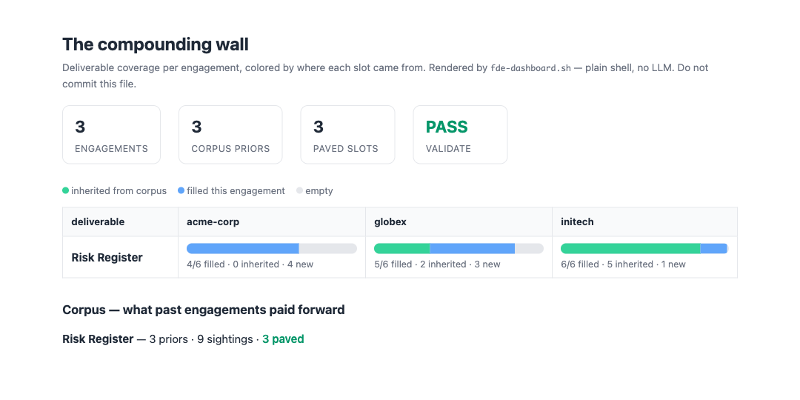

<div align="center">

# FDE-SKILLS

**FDEの道具箱: 案件で実際に使うリポジトリの厳選リストと、成果物を案件をまたいで積み上げる4つのClaude Code skill。**

<a href="../LICENSE"></a>


[English](../README.md) · 日本語

</div>

今年3社目の案件。作る成果物の「種類」は毎回同じです。リスク登録簿、連携仕様書、ステークホルダーマップ。過去2社の案件で中身の大半はすでに学んだはずなのに、どれも白紙から書き直しています。しかも役に立つツールは20個のリポジトリに散らばっていて、毎回探し直しです。

このリポジトリはその両方を解決します:

1. **厳選ツールボックス**(下記): 案件の各ステージで入れる価値のあるリポジトリを、ディスカバリーから引き継ぎまで「手に取る順番」で並べたリスト。ツールの種類別ではありません。
2. **独自の4 skill**: 上のどのリポジトリにもない一点、**記憶する成果物**のためのもの。成果物のスキーマが案件をまたいで証拠を蓄積し、3回目の再発でパターンがスキーマ本体に「舗装」されます。インストールはスクリプト1本。マーケットプレイス不要、APIキー不要、ホスト型バックエンドなし:

```bash
git clone https://github.com/mk668a/fde-skills
cd fde-skills && ./install.sh     # plain cp under the hood; read it first
```



*compounding wall(`.fde/dashboard.html`、素のshellで描画): 列がクライアント、バーが成果物。緑のスロットは過去案件からの継承、青はこの案件で新たに埋めたもの。左から右へ緑が増えていく。それがこのプロダクトです。*

---

## 🧭 ツールボックス

案件の各ステージで何を入れるか。掲載基準は「実在してメンテされており、実際の顧客業務で役に立つこと」です。(スター数は変動するので載せません。全エントリは掲載時に実在確認済みです。)

### まずこれ

| リポジトリ | 何か | 形態 |
|---|---|---|
| [anthropics/skills](https://github.com/anthropics/skills) | Anthropic公式のAgent Skills集。document skill(`docx`、`pptx`、`xlsx`、`pdf`)が、クライアントが受け取りを期待する実ファイルを書き出す。 | plugin / skillディレクトリのコピー |

### ディスカバリーとスコープ定義

| リポジトリ | 何か | 形態 |
|---|---|---|
| [github/spec-kit](https://github.com/github/spec-kit) | スペック駆動開発。曖昧な依頼を、作る前に実行可能な仕様に変える。 | CLI + slash command |
| [bmad-code-org/BMAD-METHOD](https://github.com/bmad-code-org/BMAD-METHOD) | PM・アーキテクト型のプランニングagentを備えたアジャイルAI開発フレームワーク。 | npmフレームワーク |
| [snarktank/ai-dev-tasks](https://github.com/snarktank/ai-dev-tasks) | PRD→タスクリストの軽量markdownワークフロー。 | .mdファイルのコピー |
| [obra/superpowers](https://github.com/obra/superpowers) | ブレインストーミング、計画の作成と実行、体系的デバッグ、TDD、コードレビューをskill化したもの。ディスカバリーにも実装にも効く。 | plugin |

### クライアントとの実装

| リポジトリ | 何か | 形態 |
|---|---|---|
| [wshobson/agents](https://github.com/wshobson/agents) | 多分野のpluginマーケットプレイス。アーキテクチャ、セキュリティ、データ、ドキュメントの専門agent・skill・commandが数百件。 | pluginマーケットプレイス |
| [affaan-m/ECC](https://github.com/affaan-m/ECC) | agentハーネスの最適化。skill、instinct、メモリ、hook、rule。(旧`everything-claude-code`。) | 設定コレクション |
| [VoltAgent/awesome-claude-code-subagents](https://github.com/VoltAgent/awesome-claude-code-subagents) | `.claude/agents/`にコピーして使う100以上の特化subagent。 | .mdファイルのコピー |
| [anthropics/claude-code-security-review](https://github.com/anthropics/claude-code-security-review) | 公式のAIセキュリティレビューAction。クライアントに納品する前に回す。 | GitHub Action |
| [dlt-hub/dlt](https://github.com/dlt-hub/dlt) | Pythonのデータロードパイプライン。データ系のクイックウィンへの最短ルート。 | pip |

### クライアント向け成果物

| リポジトリ | 何か | 形態 |
|---|---|---|
| [jgm/pandoc](https://github.com/jgm/pandoc) | 万能マークアップ変換。markdownを入れると`docx`/`pdf`/何でも出てくる。 | CLI |
| [quarto-dev/quarto-cli](https://github.com/quarto-dev/quarto-cli) | Pandocの上に載る技術文書パブリッシング。レポート、ダッシュボード、書籍。 | CLI |
| [marp-team/marp-cli](https://github.com/marp-team/marp-cli) | markdownからスライド(PPTX/PDF/HTML)をコマンドラインで生成。 | CLI |
| [mermaid-js/mermaid-cli](https://github.com/mermaid-js/mermaid-cli) | Mermaid図をドキュメントやスライド用の画像に描画。 | CLI |
| [terrastruct/d2](https://github.com/terrastruct/d2) | テキストから図を生成する言語。アーキテクチャ図をgitでレビューできるものにする。 | CLI |

### 顧客データの安全

| リポジトリ | 何か | 形態 |
|---|---|---|
| [microsoft/presidio](https://github.com/microsoft/presidio) | PIIの検出・伏せ字化・匿名化。顧客データが共有の場所に触れる前に通す。 | pip |

### 案件管理と引き継ぎ

| リポジトリ | 何か | 形態 |
|---|---|---|
| [makeplane/plane](https://github.com/makeplane/plane) | セルフホストのJira/Linear代替。クライアントのシートをもらえない時に。 | セルフホスト |

### さらに深く

| リポジトリ | 何か |
|---|---|
| [hesreallyhim/awesome-claude-code](https://github.com/hesreallyhim/awesome-claude-code) | Claude Codeリソース集の定番。 |
| [ComposioHQ/awesome-claude-skills](https://github.com/ComposioHQ/awesome-claude-skills) | 分野横断のClaude skill厳選リスト。 |
| [pierpaolo28/Awesome-FDE-Roadmap](https://github.com/pierpaolo28/Awesome-FDE-Roadmap) | FDEの「キャリア」ロードマップ。学習リソース、コンサルティングフレームワーク、面接対策。ツール中心の本リストと補完関係。 |

毎回の案件で手に取るのにここにないものがあれば、PRを歓迎します([コントリビュート](#-コントリビュート)参照)。

---

## 🔁 独自の4 skill: 記憶する成果物

上のどのリポジトリも、案件Nを案件N-1より楽にはしてくれません。この4つのskillが埋めるのはそこです。ここでの成果物はドキュメントではなく**型付きのスロットスキーマ**であり、スキーマは証拠とともに硬化していくバージョン管理された事前知識です。

| skill | こう言う | やること |
|---|---|---|
| `/fde-init` | 「ここにfdeをセットアップして」「Acmeの案件を始めて」 | `.fde/`の土台を作り(初回のみ)、クライアントごとのディレクトリを開く |
| `/fde-draft` | 「Acmeのリスク登録簿を書いて」 | この案件のメモから型付きスキーマを埋め、さらに過去案件から事前入力し、充足率を報告する |
| `/fde-promote` | 「この学びを再利用できるようにして」 | 匿名化し、目撃回数を数え、3回目で舗装する |
| `/fde-recall` | 「こういうパイロットで何を学んだっけ?」 | 匿名化済みの事前知識を、再発頻度の重み付きで提示する |

コマンドを覚える必要はありません。各skillには正確なトリガー記述があり、やりたいことを普通に書けば該当するものが発火します。

### Rule of Threeの機械化

「1例から一般化するな、3例目で抽出しろ」(Fowler『Refactoring』)は普通はただの心得です。ここではshellスクリプトのカウンターです:

| 目撃回数 | 段階 | `/fde-draft`での扱い |
|---|---|---|
| ×1 | candidate | `[candidate ×1: confirm]`として提案(1案件だけの意見) |
| ×2 | recurring | `[candidate ×2: confirm]`として提案 |
| ×3 | **paved** | デフォルトで事前入力。新しい観点ならスキーマ本体にスロットが追加されversionが上がる |

舗装の瞬間は、スキーマへのgit diff可能な実変更です。15秒の証明を自分で実行できます(LLM不使用、すべての数字は土台のスクリプトが出力):

```console
$ examples/demo.sh
=== Engagement 1: Acme Corp: from scratch ===
acme-corp: risk-register  ·  4/6 slots filled (66%) · 0 inherited · 4 new
  candidate ×1: sso-auth-integration (technical_risks)
  candidate ×1: rollback-plan (rollback_plan)

=== Engagement 2: Globex: inherits Acme priors ===
globex: risk-register  ·  5/6 slots filled (83%) · 2 inherited · 3 new
  sighting ×2: sso-auth-integration (technical_risks)

=== Engagement 3: Initech: third sighting PAVES the schema ===
initech: risk-register  ·  6/6 slots filled (100%) · 5 inherited · 1 new
  -> near-complete on day one: 5 of 6 slots inherited, not retyped.
  sighting ×3: sso-auth-integration (technical_risks)
PAVED: risk-register v1 -> v2: + rollback_plan (3 sightings)

--- the schema itself just changed (git-diff-able expertise) ---
  -version: 1
  +version: 2
  -evolved_slots: []
  +evolved_slots:
  +  - id: rollback_plan
  +    label: Rollback plan
  +    prompt: "How do we return to the pre-pilot state if go-live fails?"
  +    paved_from: "3 sightings, 2026-07-04"

=== Confidentiality check (shared layers must be client-anonymous) ===
validate: OK: no client identifiers in corpus/ or research/
```

3案件を回した後の`git diff .fde/schemas/`には、クライアントが教えてくれたことだけが、クライアント抜きで写っています。`examples/demo.sh --live`を使うと、同じ流れを自動更新のダッシュボードで見られます(冒頭のスクリーンショットもそれで撮りました)。

### 二層構成: 正直な役割分担

| 層 | 何か | 例 |
|---|---|---|
| **LLM skill層**(`skills/*`) | 雑多なメモを読む、スロットを埋める、クライアント固有の情報を言い換えて消す、何が再利用に値するか判断する | `/fde-draft`、`/fde-promote` |
| **決定論的な土台**(`.fde/bin/*.sh`) | 数える、伏せる、堰き止める、舗装する、描画する。LLMなし、再現可能、監査可能 | `fde-coverage.sh`、`fde-promote.sh`、`fde-validate.sh`、`fde-dashboard.sh` |

充足率も目撃カウンターも伏せ字ゲートもダッシュボードも、すべて素のshellです。判断はすべてあなた(とあなた自身のClaude Code)のもの。実行時にLLMを呼ぶものは何もなく、ホストされるものも何もありません。

### ワークスペースの構成

```
.fde/                          the spine (commit-safe: schemas + anonymized corpus)
  config.yml                   deliverable types + paving threshold + extra identifiers
  schemas/<type>.schema.yml    slot definitions that evolve across engagements
  corpus/<type>.yml            anonymized priors with sighting counters
  bin/*.sh                     the deterministic scripts
  dashboard.html               the compounding wall (never commit)
engagements/                   CONFIDENTIAL: one dir per client, never cross-read
  acme-corp/
    engagement.yml, notes/, deliverables/
```

成果物スキーマは8種類を同梱しています(ディスカバリードキュメント、連携仕様書、オントロジーマップ、デリバリースケジュール、リスク登録簿、調査報告書、ステークホルダーマップ、定着化プラン)。各スロットのプロンプトは名前のある手法(プレモーテム、MEDDPICC、ピラミッド原則、Working-Backwardsなど)に紐付いています。

---

## 🔒 機密の守り方: 約束ではなくゲート

何が機械的に強制され、何が判断に委ねられるかを正確に:

- **強制(決定論的):** 案件のスラグ、クライアント名のトークン、設定した追加識別子が共有レイヤーに現れたら`fde-validate.sh`が失敗します。`fde-promote.sh`はマージ結果を一時ファイルに作り、識別子が漏れる場合はそもそも書き込みを拒否します。金額とパーセンテージは常に除去されます。
- **判断(LLM+あなた):** 人名、社内システム名、「読めば分かる」言い回しは`/fde-promote` skillが言い換えて消します。スクリプトには推測できないので、恒久的に「機械で」守りたいものは`.fde/config.yml`の`anonymization.extra_identifiers`に入れてください。
- 知識が案件をまたぐ経路は`/fde-promote`が**唯一**です。skillが他クライアントの`engagements/<other>/`ディレクトリを読むことはありません。

### 顧客情報をGitHubに上げない

`/fde-init`は`engagements/`と`.fde/dashboard.html`を`.gitignore`に入れます。そのまま維持してください。リモートへのpushは事実上取り消せません(クローン、フォーク、キャッシュ、コード検索のインデックス)。プライベートリポジトリも安全地帯ではありません。コミットしてよいのは匿名化済みの`.fde/corpus/`と`.fde/schemas/`だけで、それも`fde-validate.sh`が通ってからです。多くの案件では、リモートに顧客名が載ること自体が契約違反・NDA違反です。匿名化コーパスは、クライアント抜きで「再利用可能な構造」だけを生かすために存在します。

---

## ❓ なぜ「FDE」なのか

Forward Deployed Engineerは、この道具が想定する役割そのものです。常駐し、複数クライアントを行き来し、成果物が多い。ただし、ツールボックスも積み上げの仕組みも、「同じ種類の成果物を別々のクライアントに納め続ける人」なら誰にでも効きます。デリバリーコンサルタント、常駐PM、ソリューションアーキテクト、フラクショナルCTO。名前は楔で、仕組みは汎用です。

---

## 🤝 コントリビュート

**ツールボックスへの追加:** 該当ステージに1行追加するPRを送ってください。基準は「実在し、メンテされていて、あなたが実際の案件で手に取ること」。説明は1行、宣伝文句なし。

**skill:** 各skillは`skills/<name>/SKILL.md`が1枚。`/fde-init`が撒く土台は`skills/init/templates/`にあります。ローカルでは`./install.sh`と`examples/demo.sh`で確認できます。skillやスキーマを変えるPRでは、英語と日本語の両READMEを更新してください。

---

## 📄 ライセンス

MIT。[LICENSE](../LICENSE)を参照。
