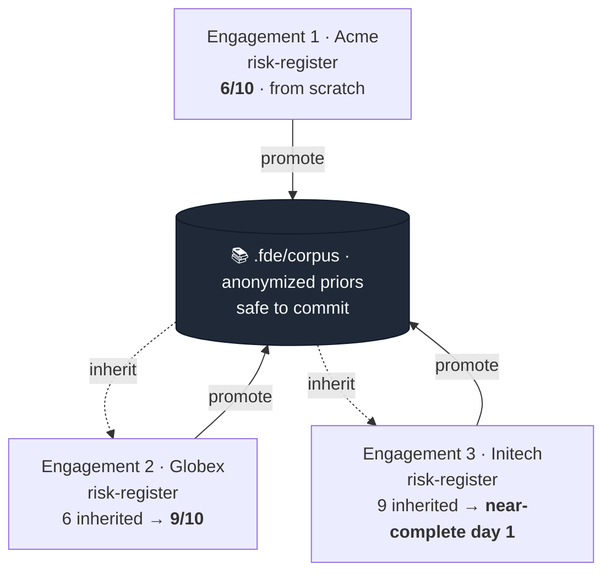
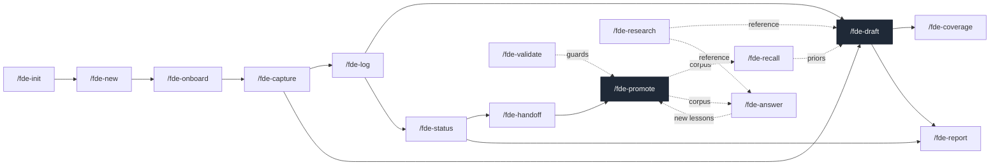
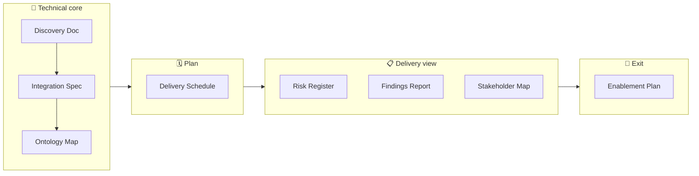

<div align="center">

# FDE-SKILLS

**案件の成果物づくりは、回を重ねるほど楽になっていくのが本来の姿です。いまはそうなっていません。**

<a href="../LICENSE"></a>


[English](../README.md) · 日本語

</div>

FDE(Forward Deployed Engineer)、デリバリーコンサルタント、常駐PMのためのClaude Code用skillパックです。案件をいくつ回しても、作る成果物の「種類」はだいたい同じです。リスク登録簿、調査報告書、ステークホルダーマップ。それなのに実際は、案件が変わるたびに白紙から書き直しています。FDE-SKILLSは、成果物の裏側にある**スキーマ**を案件をまたいで残し、次の案件では事前入力された状態から始められるようにします。3社目の案件は、2社目で苦労して固めた構造の続きから書き始められます。

ホスト型バックエンドなし、APIキーなし、ベンダーロックインなし。skillは**自分のClaude Code**の上で動き、土台は素のshellスクリプトです。顧客データが手元のマシンから外に出ることはありません。

---

## 🚀 クイックスタート

マーケットプレイスは使いません。リポジトリをcloneしてインストーラを実行するだけです。中身はただの`cp`なので、実行前に読んで確かめられます。17個のskillを個人のskillディレクトリへ、2つの共有サブエージェントを個人のagentsディレクトリへ、どちらも`fde-*`の名前で配置します(initやnewのような汎用名がほかとぶつからないようにするためです)。土台のshellスクリプト一式は`init` skillに同梱されているので、インストール先はこの2箇所だけです。

```bash
git clone https://github.com/mk668a/fde-skills
cd fde-skills
./install.sh                 # copies fde-* skills + subagents into ~/.claude
# ./install.sh -u            # uninstall everything it copied
```

手作業でも、やることはコピー2回です。install.shはそこに`sed`をひとつ足して、各skillの`name:`を`fde-*`に書き換えています。これでコマンドが`/fde-init`や`/fde-draft`になります(そのままコピーすると`/init`や`/draft`のままになり、ほかのskillとぶつかることがあります)。

```bash
# 1. skills (one dir each; init carries the spine templates with it)
for d in skills/*/; do cp -R "$d" ~/.claude/skills/"fde-$(basename "$d")"; done
# 2. the shared subagents (names already fde-*)
cp agents/*.md ~/.claude/agents/
```

あとはどのワークスペースでも、やりたいことをそのまま書くだけです(明示的なコマンドも使えます)。

```text
set up fde here              # or /fde-init  (scaffolds .fde/: spine + schemas + empty corpus)
new engagement with Acme     # or /fde-new "Acme Corp"
```

`/fde-init`は、skillに同梱された`templates/`(`${CLAUDE_SKILL_DIR}`で解決されます)からワークスペースの`.fde/`へ土台をコピーします。そこから先はライフサイクルのskillが引き継ぎます。すべて**自分のClaude Code**の上で動き、どこにもホストされません。

---

## 🔁 案件をまたいで積み上がる仕組み

成果物を1枚のドキュメントではなく、**スロットの型付きスキーマ**として扱います。スキーマは共有ワークスペースに置かれ、個々の案件が終わっても残り続けます。



実線のpromoteが、匿名化した学びを共有コーパス(案件をまたいだ知見の置き場)に書き出します。破線のinheritが、それを次の案件に引き継ぎます。スロットの充足率は案件を追うごとに上がっていきます。仕組みはこれだけです。

これはPalantirのforward-deployedモデルと同じ進め方です。まず案件固有の解を素早く作り、そこから再利用できる構造だけを共有資産へ一般化して、次の案件はその上から始める。ここでの共有資産が型付きスキーマと匿名化コーパスで、その一般化を担うのが`/fde-promote`です。

---

## 🧱 二層構成

FDE-SKILLSは、決定論的なshellスクリプト群の上にLLMの層を載せた二層でできています。ユーザーに「出力は非決定的、ゲートは決定的」という原則を信頼してほしいと言う以上、製品自身も同じ原則で組み立ててあります。LLMの層はさらに2つに分かれます。自分で起動するskillと、skillが重い読み込みや調査を任せる共有サブエージェントです。

| 層 | 中身 | 例 |
|---|---|---|
| **LLM skill** (`skills/*`) | 雑多なメモを読み、スロットを埋め、匿名化し、何が再利用できるかを判断する | `/fde-draft`、`/fde-promote`、`/fde-onboard` |
| **共有サブエージェント** (`agents/*`) | 複数のskillから呼ばれる独立コンテキストの処理役。重い読み込みで会話を埋めない | `fde-retriever`(recall + answer)、`fde-researcher`(research + answer) |
| **決定論的スクリプト** (`.fde/bin/*.sh`) | 数える、雛形を作る、伏字にする、検証する、書き出す。LLMなしで毎回同じ結果 | `fde-coverage.sh`、`fde-promote.sh`、`fde-validate.sh`、`fde-report.sh` |

充足率の数字は、モデルの推定値ではなくshellスクリプトの計算結果です。顧客名をコーパスに入れないための機密ガードもshellスクリプトなので、実行のたびに結果がぶれることはありません。`/fde-answer`の裏で動く検索も、仕組み上ほかの顧客のディレクトリに触れないサブエージェントの中で実行されます。

---

## 💬 コマンドを覚える必要はありません

skillは17個ありますが、`/fde-`コマンドを自分で打つ場面はほとんどありません。各skillに「いつ使うか」が細かく書いてあり、Claude Codeが**普通の日本語のプロンプトから該当するskillを選んで起動します**。やりたいことを書くだけです。

| こう打つ(自由なプロンプト) | 起動するskill |
|---|---|
| 「このワークスペースでfdeを使えるようにして」 | `/fde-init` |
| 「Globexの案件を新しく始める。フィンテックのパイロット」 | `/fde-new` |
| 「この打ち合わせメモからcontext mapを作って」 | `/fde-onboard` |
| 「Acmeのintegration specをドラフトして」 | `/fde-draft` |
| 「今日の作業を日誌にまとめて」 | `/fde-log` |
| 「risk registerの埋まり具合を見せて」 | `/fde-coverage` |
| 「HL7 FHIRという規格について調べて」 | `/fde-research` |
| 「似たようなパイロット案件から学んだことある？」 | `/fde-recall` |
| 「顧客からSSO障害時の扱いを聞かれた。回答案を作って」 | `/fde-answer` |
| 「この学びを他の案件でも使い回せるようにして」 | `/fde-promote` |
| 「スポンサー向けに今週の進捗報告を書いて」 | `/fde-status` |
| 「risk registerをPDFにして」 | `/fde-report` |
| 「顧客を特定できる情報が漏れていないかチェックして」 | `/fde-validate` |

特定のskillを確実に使いたいときは`/fde-*`の明示形も使えます。ただしこれは自動選択を上書きするための手段で、ふだん打つものではありません。下のskill一覧も、暗記するためではなく、何ができるかを見渡すためのものです。

---

## 🧰 17個のskill

17個で1つのライフサイクルになっています。セットアップは最初の一度だけ。あとは案件ごとにonboard→capture→log→draftと進んで納品し、`promote`が学びをコーパスへ書き出し、`recall`がそれを次の`draft`に持ち込みます。どのskillも、やりたいことを書けば起動します(上の表を参照)。スラッシュ名は図を読むためのラベルです。



| skill | いつ使うか | 手法・用語 |
|---|---|---|
| `/fde-init` | `.fde/`ワークスペースを用意する(最初に一度だけ) | 上書きしない冪等な雛形生成 |
| `/fde-new` | 新しい案件を始める | 案件ごとのディレクトリ分離 |
| `/fde-onboard` | 初週に集めた素材をcontext mapに整理する | Jobs-To-Be-Done(Christensen)+なぜなぜ分析(Toyoda) |
| `/fde-capture` | メモ、決定事項、リスク、所見をその場で記録する | 1メモを1スロットへ振り分け |
| `/fde-log` | 一日の作業を日付ごとの日誌にまとめる | 朝会の3つの質問(Scrum) |
| `/fde-draft` | **型付き成果物のドラフトを作る。前提は案件をまたいで引き継ぐ** | スロットスキーマの継承 |
| `/fde-coverage` | スロットの充足率と残りを確認する | Definition of Done / 完了基準 |
| `/fde-research` | webで調べて共有の`research/`ライブラリに保存する | 複数出典での裏取り(一次資料優先) |
| `/fde-recall` | 過去案件の匿名化済みの知見を引き出す | 知見をパターンとして提示 |
| `/fde-answer` | 顧客の質問にナレッジベースから引用して答える | 出典に基づく引用付き回答 |
| `/fde-promote` | 学びを共有コーパスに上げる(匿名化込み) | 砂利道→舗装路(Palantir) |
| `/fde-status` | 顧客向けの進捗報告を書く | BLUF(結論から先に) |
| `/fde-report` | 成果物をきれいなHTML / PDFに書き出す(mermaidの図もそのまま描画) | 自己完結・依存ゼロの書き出し |
| `/fde-handoff` | 案件のクローズアウトをまとめる | context mapと突き合わせるクローズアウト |
| `/fde-list` | 全案件と進捗を一覧する | ポートフォリオの俯瞰 |
| `/fde-schema` | 成果物の型とスロットを確認・追加する | 型付きスキーマの進化 |
| `/fde-validate` | 機密性と整合性を検査する | 識別子リークの防止ゲート |

---

## 📦 同梱する8つの成果物スキーマ

案件の始まりから終わりまでをカバーする8つのスキーマを同梱しています。`/fde-schema`で自分のスキーマも追加できます。



各スロットのプロンプトは、**確立した手法名に紐づけて**書いてあります。おかげでドラフトが、その仕事で実際に使われている語彙で出てきます。Discovery DocはJobs-To-Be-Done(Christensen)、なぜなぜ分析(Toyoda)、Working-Backwards(Amazon)に、Integration SpecはMedallion architecture(Databricks)、idempotency keys(Stripe)、Foundry ontology(Palantir)に、Delivery ScheduleはCritical Path Method(Kelley & Walker)とgo-liveからのWorking-Backwardsに、Stakeholder MapはMendelowのpower/interestグリッドとMEDDPICCに、Findings ReportはPyramid Principle(Minto)に紐づきます。手法名を明示すること自体が、精度を上げる工夫でもあります。モデルが曖昧に推測せず、既存のフレームワークに沿って埋めるからです。

> install.shはskillを`fde-*`の名前で配置するので、明示コマンドは`/fde-init`、`/fde-draft`のようになります。リポジトリと製品の名前は**FDE-SKILLS**です(コマンドが`claude`である`claude-code`リポジトリと同じ関係です)。

---

## ✨ スケジュール、日々の記録、レポート、リサーチ、引用付き回答

このライフサイクルには、常駐エンジニアが日々の仕事で必要とする5つの機能も組み込んであります。

- **積み上がるスケジュール。** Delivery Scheduleは8つ目の成果物で、使い捨てのファイルではありません。discovery→integration→pilot→production→enablementという流れ、進行のリズム、各フェーズの完了条件といった**構造**は、顧客が変わってもほとんど変わりません。だから`/fde-draft`がコーパスから事前入力し、この顧客の日付を入れるだけで済みます(go-liveからのWorking-Backwards、CPMによるクリティカルパス)。
- **日々の記録。** `/fde-capture`がその場の断片メモを記録し、`/fde-log`が一日ぶんを`journal/<date>.md`にまとめます(朝会形式: やったこと / 次にやること / 詰まっていること)。日次の記録が週次報告(`/fde-status`)につながり、週次報告がクローズアウト(`/fde-handoff`)につながります。
- **きれいなHTML / PDFレポート。** `/fde-report`は成果物を整えて、**mermaidの図がそのまま表示される**自己完結HTMLに書き出します。PDFも作れます。依存はゼロ。HTML自体に印刷用CSSが入っているので、受け取った人はブラウザで開いて印刷からPDF保存するだけです。ヘッドレスChromeが入っていれば、`--pdf`で図も含めて直接PDFにできます。
- **共有リサーチライブラリ。** `/fde-research`はwebで調べた結果をワークスペース直下の`research/`に保存します。データ規格、ベンダーの比較、規制の全体像など、どの案件からでも参照できます。内容は顧客に依存しないのでcommitでき、コーパスと同じ識別子チェックの対象になります。
- **ナレッジベースからの引用付き回答。** `/fde-answer`は顧客からの質問を受け取り、この案件のメモ、匿名化コーパス、リサーチライブラリを引用しながら根拠のある回答を組み立てます。主張には必ず出典を付け、答えられない箇所は答えられないと明示します。再利用できる学びが出てきたら`/fde-promote`や`/fde-capture`に回すので、回答するたびにナレッジベースも育ちます。

---

## 🗂 ワークスペースの構成

`/fde-init`は、`init` skillに同梱された`skills/init/templates/`からこの構成をそのまま展開します。テンプレートのツリーと展開後の`.fde/`は常に一致します。`skills/init/templates/schemas/`にスキーマを足して`skills/init/templates/config.yml`に登録すれば、それ以降に作るワークスペースすべてに反映されます。

```
.fde/                          ← ワークスペースの土台(commit可: schemas + 匿名化コーパス)
  config.yml                   成果物の型(8つ同梱) + 匿名化ルール
  schemas/                     案件をまたいで残り、進化するスロット定義
    discovery-doc.schema.yml     ┐ 技術コア
    integration-spec.schema.yml  │
    ontology-map.schema.yml      ┘
    delivery-schedule.schema.yml ← 計画
    risk-register.schema.yml     ┐ 配信ビュー
    findings-report.schema.yml   │
    stakeholder-map.schema.yml   ┘
    enablement-plan.schema.yml   ← 出口
  corpus/*.md                  匿名化した案件横断の知見(共有層)
  bin/*.sh                     決定論的スクリプト(LLMなし)。fde-report.shを含む
  index.yml                    案件の登録簿
research/                      ← 共有・commit可: webリサーチのまとめ(/fde-research)
  <topic>.md                   出典付き、顧客非依存、どの案件からも再利用可
engagements/                   ← 機密: 顧客ごとに1ディレクトリ、横断参照しない、pushしない
  acme-corp/                     slug。"Acme Corp" から自動生成
    engagement.yml               client / status / started      (/fde-new)
    onboard/
      context-map.md             Who / Why / Scope / Constraints (/fde-onboard)
    notes/
      <date>-<kind>.md           その場の断片メモ、決定、リスク    (/fde-capture)
    journal/
      <date>.md                  一日ぶんを朝会形式でまとめる     (/fde-log)
    deliverables/
      <type>.md                  人間可読の成果物                (/fde-draft)
      <type>.slots.yml           coverage計算用の機械状態         (/fde-draft)
    status/
      <date>.md                  顧客向け進捗、BLUF + RAG         (/fde-status)
    reports/
      <type>.html / .pdf         顧客に渡す清書版                (/fde-report)
    answers/
      <date>-<slug>.md           顧客の質問への引用付き回答        (/fde-answer)
    handoff.md                   案件のクローズアウト             (/fde-handoff)
  globex/  ...                   別の顧客。同じ形。横断参照しない
```

`<type>`には8つのスキーマidのどれかが入ります。全体は性質の異なる2つの層でできています。案件をまたいで積み上がりcommitできる**共有層**(匿名化した成果物の知見が入る`.fde/corpus/`と、顧客非依存の参考資料が入る`research/`)と、機密のまま顧客ごとに閉じる`engagements/<client>/`です。顧客側からコーパスへ上がる経路は`/fde-promote`だけで、通過するときに匿名化されます。

---

## 🔒 設計で機密を守る

- 生の顧客素材は`engagements/<client>/`に置き、案件をまたいで読むことはありません。`engagements/*/onboard/`、`notes/`、`journal/`、`reports/`、`answers/`は`.gitignore`に入れてください。
- 知見が案件の境界を越える経路は`/fde-promote`**だけ**です。promoteは通過時にまず匿名化します(skillによる意味レベルの言い換えに加えて、数値や既知の顧客識別子を消す決定論的な正規表現のバックストップ)。共有の`research/`ライブラリは、そもそも顧客非依存の内容しか置かない設計です。
- `fde-validate.sh`は、共有層(`.fde/corpus/`と`research/`)のどこかに顧客識別子(スラッグ、社名、特定につながる名前トークン)が現れたらエラーにします。commitの前に実行してください。

### 顧客情報をGitHubに上げない

**`engagements/`は、publicかprivateかを問わずリモートにpushしないでください。** commitしてよいのは匿名化済みの`.fde/corpus/`だけで、それも`fde-validate.sh`が通ってからです。いちばん安全なのは、gitで管理しない別ワークスペースで作業するか、`engagements/`を`.gitignore`に入れておくことです。

理由は、リモートへのpushが実質的に取り消せないからです。データが手元のマシンを離れた瞬間から、気づかないうちにcloneやforkをされ、GitHub側にキャッシュされ、コード検索にインデックスされる可能性があります。**あとからファイルを消しても元には戻りません。** 履歴には残り続けますし、force-pushで履歴を書き換えても、すでに他人がpullしたコピーや第三者のキャッシュまでは消せません。privateリポジトリも安全地帯ではありません。権限の変更、組織の移管、公開設定の誤操作は実際に起こります。一度リモートに出た顧客名や数値、社内情報は、二度と消せず自分の管理も及ばないものとして扱ってください。多くの案件で、それは契約違反でありNDA違反です。匿名化コーパスは、背後の顧客を出さずに再利用できる構造だけを共有するためにあります。

---

## ❓ なぜ「FDE」なのか

Forward Deployed Engineerは、この製品が想定する働き方です。顧客先に入り込み、複数の顧客を並行して持ち、成果物が多い。とはいえ、同じ「種類」の成果物を顧客ごとに作る人(デリバリーコンサルタント、常駐PM、ソリューションアーキテクト)なら、誰でも同じように積み上がります。FDEという名前は想定ユーザーの目印で、仕組み自体は汎用です。

---

## 🤝 コントリビュート

Issue / PR歓迎です。構成は小さくまとまっています。skillは`skills/<name>/SKILL.md`に1つずつ、共有サブエージェントは`agents/*.md`に、`/fde-init`が展開する土台は`skills/init/templates/`にあります。手元での動作確認は`./install.sh`でできます。skillやスキーマを足すPRでは、英語と日本語両方のREADMEを更新してください。

---

## 📄 ライセンス

MIT。[LICENSE](../LICENSE)を参照してください。
